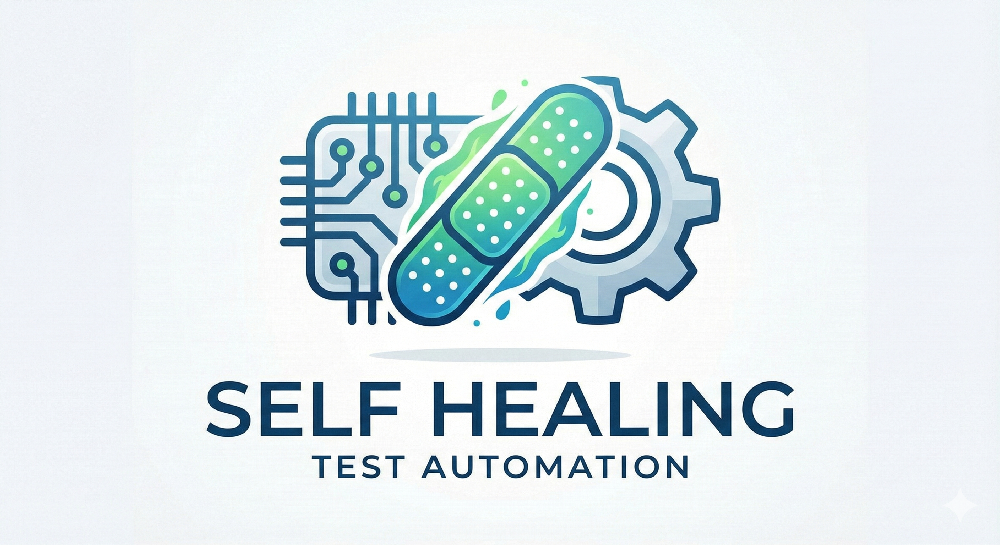
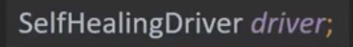
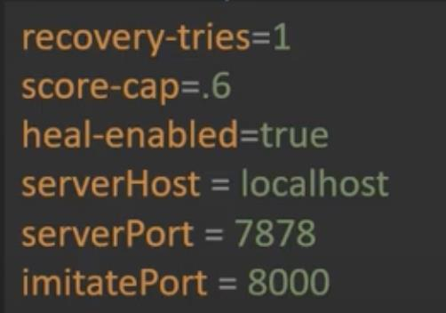
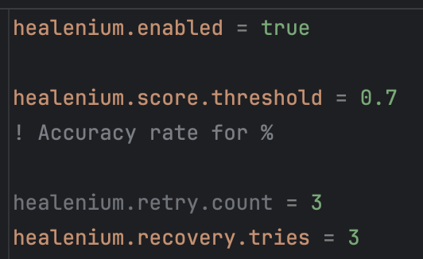
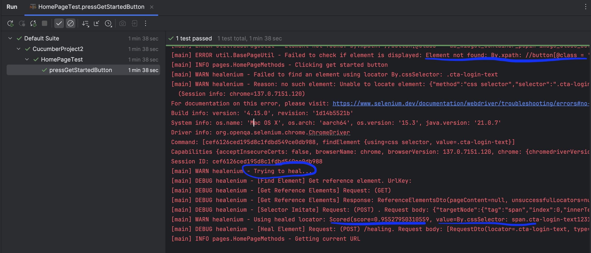

  
  <h1 style="font-size: 28px; margin: 10px 0;">Self Locator Healing Project </h1>
  
Reduce Your Selector Maintenance Cost

[![LinkedIn][linkedin-shield]][linkedin-url]
[![Medium][medium-shield]][medium-url]
[![Contributors][contributors-shield]][contributors-url]
[![Forks][forks-shield]][forks-url]
[![Stargazers][stars-shield]][stars-url]
[![Issues][issues-shield]][issues-url]

[contributors-shield]: https://img.shields.io/github/contributors/alikaya2/Self-Healing-Selenium-TDD-Project.svg?style=for-the-badge
[contributors-url]: https://github.com/alikaya2/Self-Healing-Selenium-TDD-Project/graphs/contributors
[forks-shield]: https://img.shields.io/github/forks/alikaya2/Self-Healing-Selenium-TDD-Project.svg?style=for-the-badge
[forks-url]: https://github.com/alikaya2/Best-README-Template/network/members
[stars-shield]: https://img.shields.io/github/stars/alikaya2/Self-Healing-Selenium-TDD-Project.svg?style=for-the-badge
[stars-url]: https://github.com/othneildrew/Self-Healing-Selenium-TDD-Project/stargazers
[issues-shield]: https://img.shields.io/github/issues/alikaya2/Self-Healing-Selenium-TDD-Project.svg?style=for-the-badge
[issues-url]: https://github.com/alikaya2/Self-Healing-Selenium-TDD-Project/issues
[linkedin-shield]: https://img.shields.io/badge/-LinkedIn-black.svg?style=for-the-badge&logo=linkedin&colorB=555
[linkedin-url]: https://linkedin.com/in/alikaya000
[medium-shield]: https://img.shields.io/badge/Medium-12100E?style=for-the-badge&logo=medium&logoColor=white
[medium-url]: https://medium.com/@alikayakornomer/test-otomasyonda-bakım-maliyetini-azaltın-self-healing-a6ce0247488d

## Description
Web selenium is working for Mobile(appium) and web selenium. 
It's explained AI Powered self-healing library. Especially tools which is present AI tool generally contains Healenium.

## Starting

1. Clone the repo from Github
2. `mvn clean install`
3. Start Healenium services: `docker-compose up -d`
4. Generate Allure report: `mvn allure:report`

## Config
- Healenium has SelfHealingDriver instead of Webdriver object. You need to launch it with that to heal any locator.

- `config.properties`: Browser and test settings
- `healenium.properties`: Healenium self-healing settings

(<a href="#readme-top">back to top</a>)

With healenium enable configuration, you can easily change your driver to heal locators. Please check the Driver package on the project. 

## How It Works?
If there is any selector changing before we test executioning, firstly we get "Element not found" warning, then the healenium steps in and detect new selector.
It gives us a scoreand new selector. 
Therefore the test without get failed, fixes the problem and get pass. 

>[!IMPORTANT]
> [You can read the detailed document on Medium Blog](https://medium.com/@alikayakornomer/test-otomasyonda-bakım-maliyetini-azaltın-self-healing-a6ce0247488d)

